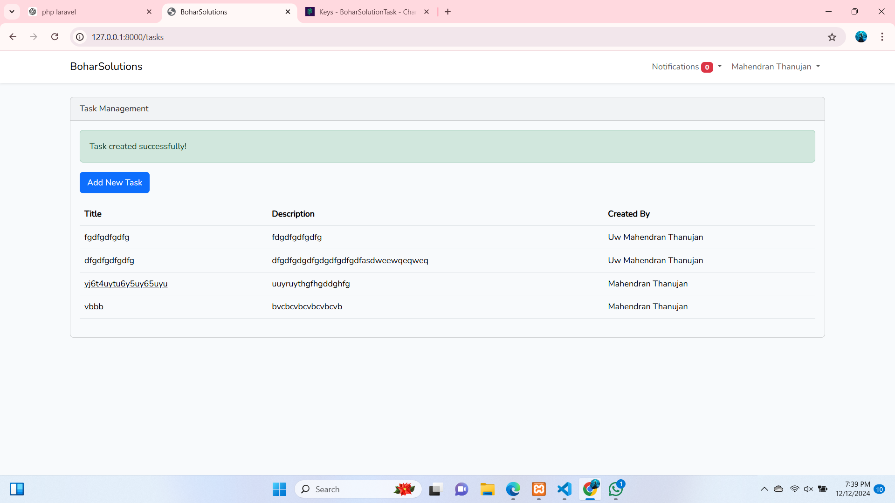

# Laravel Developer Intern Task - Bohar Solutions

This repository contains the completed task assigned for the Laravel Developer Intern position at Bohar Solutions. The project demonstrates proficiency in Laravel development, including setup, features implementation, and enabling push notifications.

## Table of Contents
- [Getting Started](#getting-started)
- [Installation and Setup](#installation-and-setup)
- [Git Workflow](#git-workflow)
- [Enabling Push Notifications](#enabling-push-notifications)
- [Features Implemented](#features-implemented)

## Getting Started
Follow the instructions below to set up and run the project locally.

## Installation and Setup

### Prerequisites
Make sure you have the following installed on your system:
- PHP >= 8.0
- Composer
- Laravel >= 9.0
- MySQL or any supported database
- Node.js and npm (for frontend dependencies)

### Steps

1. Clone the repository:
   ```bash
   git clone https://github.com/yourusername/laravel-intern-task.git
   cd laravel-intern-task
   ```

2. Install dependencies:
   ```bash
   composer install
   npm install
   ```

3. Copy the `.env` file:
   ```bash
   cp .env.example .env
   ```

4. Set up environment variables in the `.env` file. Update database credentials and any necessary configurations:
   ```env
   DB_CONNECTION=mysql
   DB_HOST=127.0.0.1
   DB_PORT=3306
   DB_DATABASE=bohar_solutions_task
   DB_USERNAME=root
   DB_PASSWORD=
   ```

5. Generate the application key:
   ```bash
   php artisan key:generate
   ```

6. Run migrations and seed the database:
   ```bash
   php artisan migrate --seed
   ```

7. Start the development server:
   ```bash
   php artisan serve
   ```

8. Compile frontend assets (if applicable):
   ```bash
   npm run dev
   ```

## Git Workflow

### Cloning the Repository
1. Open your terminal and navigate to your desired directory.
2. Run the following command:
   ```bash
   git clone https://github.com/ThanuMahee12/laravel-developer-intern-task--boharSolutions.git
   ```

### Pushing Changes
1. Add your changes to the staging area:
   ```bash
   git add .
   ```
2. Commit your changes with a meaningful message:
   ```bash
   git commit -m "Your commit message"
   ```
3. Push your changes to the remote repository:
   ```bash
   git push origin main
   ```

## Enabling Push Notifications

To enable push notifications in this Laravel project, follow the steps below:

1. Install the required package for push notifications:
   ```bash
   composer require laravel-notification-channels/webpush
   ```

2. Add the following settings to your `.env` file:
   ```env
   VAPID_PUBLIC_KEY=your_public_key
   VAPID_PRIVATE_KEY=your_private_key
   VAPID_SUBJECT=mailto:your_email@example.com
   ```

3. Implement push notifications in your project by creating notifications using Laravel's notification system.

## Features Implemented
- User authentication (login, registration, password reset).
- CRUD operations for [specific resource].
- Push notifications for [specific event].
- Responsive design for the user interface.

---

## Screenshots

### Dashboard


Thank you for reviewing my completed Laravel Developer Intern task! If you have any questions or need further clarification, feel free to reach out.
